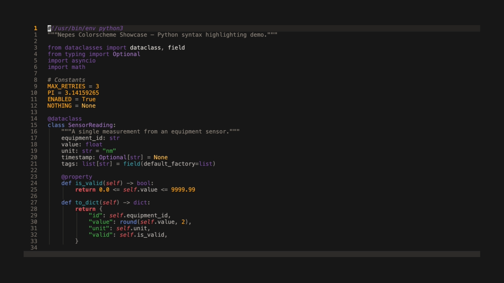
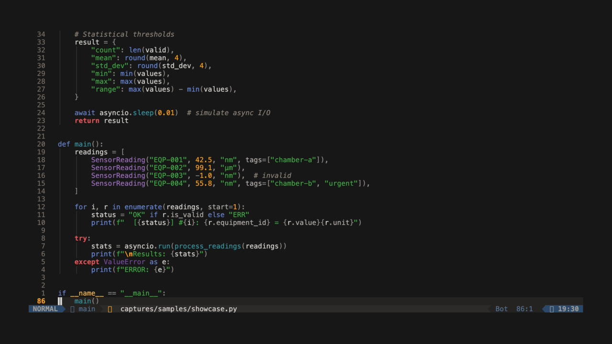

* Neovim Configuration

Lightweight Neovim 0.12 configuration using [[https://github.com/folke/lazy.nvim][lazy.nvim]] as a plugin loader with native LSP and completion.
Part of the [[https://github.com/kayspark/.dotfiles][dotfiles]] repo as a git submodule.

** Screenshots

| Dark | Light |
|------+-------|
|  |  |

*** Demo

| Dark | Light |
|------+-------|
|  |  |

| Neovim     | 0.12+ (no framework — lazy.nvim loader only)          |
| LSP        | Native =vim.lsp.config/enable= + nvim-lspconfig defaults |
| Completion | Native =vim.lsp.completion.enable= (no blink.cmp)      |
| Theme      | [[https://github.com/kayspark/nvim-nepes][nepes]] (dark/light, transparent)                       |
| Nav        | smart-splits.nvim (cross Ghostty/tmux panes)           |
| Git        | Neogit + Diffview                                      |
| Picker     | snacks.nvim (picker, explorer, indent, notifier)       |

** Key Choices

- *No framework* — previously used LazyVim; replaced with 30 hand-picked plugins + Neovim 0.12 built-ins.
- *Native LSP* — =vim.lsp.config()= / =vim.lsp.enable()= with nvim-lspconfig providing server defaults. 19 servers configured.
- *Native completion* — =vim.lsp.completion.enable()= with autotrigger. No blink.cmp/nvim-cmp.
- *Neogit-first Git workflow* — stage/commit/push from Neogit, diff review via Diffview.
- *smart-splits.nvim* — seamless navigation across editor splits and Ghostty/tmux panes.
- *Nepes corporate theme* — matching colorscheme across Emacs, tmux, Ghostty, starship.

** Plugin Count

30 plugins total (including dependencies). See =lua/plugins/= for all specs.

* Installation

#+begin_src bash
git clone https://github.com/kayspark/neovim_for_multi_languages ~/.config/nvim
nvim  # lazy.nvim installs plugins on first run
#+end_src

* Key Maps

** Finder (snacks.nvim)

| Mode | Key          | Action         |
|------+--------------+----------------|
| n    | =<leader>ff= | Find files     |
| n    | =<leader>fg= | Grep           |
| n    | =<leader>fb= | Buffers        |
| n    | =<leader>fh= | Help           |
| n    | =<leader>fr= | Recent files   |
| n    | =<leader>e=  | File explorer  |

** Diagnostics (Trouble)

| Mode | Key          | Action                    |
|------+--------------+---------------------------|
| n    | =<leader>xx= | Diagnostics (Trouble)     |
| n    | =<leader>xX= | Buffer diagnostics        |
| n    | =<leader>xq= | Quickfix list (Trouble)   |
| n    | =<leader>xl= | Location list (Trouble)   |
| n    | =<leader>xt= | TODOs (Trouble)           |

** Search & Replace

| Mode | Key          | Action           |
|------+--------------+------------------|
| n    | =<leader>sr= | GrugFar (search and replace) |

** General

| Mode | Key          | Action                              |
|------+--------------+-------------------------------------|
| n    | =<leader>bn= | Next buffer                         |
| n    | =<leader>bp= | Previous buffer                     |
| v    | =<leader>y=  | Yank selection to system clipboard  |
| n    | =<leader>yp= | Paste from clipboard (after)        |
| n    | =<leader>yP= | Paste from clipboard (before)       |
| n    | =g==          | Increment number                    |
| n    | =g-=          | Decrement number                    |
| v    | =g==          | Increment numbers sequentially      |
| v    | =g-=          | Decrement numbers sequentially      |
| n    | =<C-w>z=     | Zoom toggle (like tmux =C-b z=)     |
| v    | =<C-s>=      | Sort selected lines                 |
| v    | =<leader>rr= | Replace selected text in whole file |
| v    | =J=          | Move selected line(s) down          |
| v    | =K=          | Move selected line(s) up            |

** Smart Splits Navigation

Uses [[https://github.com/mrjones2014/smart-splits.nvim][smart-splits.nvim]] — moves across Neovim splits and WezTerm/tmux panes seamlessly.

| Mode | Key     | Action                   |
|------+---------+--------------------------|
| n    | =<C-h>= | Move to left split/pane  |
| n    | =<C-j>= | Move to below split/pane |
| n    | =<C-k>= | Move to above split/pane |
| n    | =<C-l>= | Move to right split/pane |
| n    | =<A-h>= | Resize left              |
| n    | =<A-j>= | Resize down              |
| n    | =<A-k>= | Resize up                |
| n    | =<A-l>= | Resize right             |

** Git

Neogit is the primary Git UI.

| Mode | Key          | Action            |
|------+--------------+-------------------|
| n    | =<leader>gg= | Neogit status     |
| n    | =<leader>gc= | Neogit commit     |
| n    | =<leader>gd= | Diffview open     |
| n    | =<leader>gD= | Diffview close    |
| n    | =]g=         | Next git hunk     |
| n    | =[g=         | Previous git hunk |
| n    | =gs=         | Stage hunk        |
| n    | =gS=         | Stage buffer      |
| n    | =gx=         | Reset hunk        |
| n    | =gX=         | Reset buffer      |
| n    | =gu=         | Undo stage hunk   |
| n    | =gh=         | Preview hunk      |

*** Git Workflow (Neogit + Diffview)

Recommended day-to-day flow:

**** 1) Add / stage changes
- Open Neogit status: =<leader>gg=
- Stage from Neogit status buffer (Magit-style) for file/hunk selection.
- Or stage directly from code with gitsigns:
  - =gs= stage hunk
  - =gS= stage buffer
  - =gh= preview hunk before staging

**** 2) Commit
- Open commit flow: =<leader>gc=
- Write commit message in the commit buffer.
- Save and confirm commit from Neogit.
- If commit signing is required, follow =docs/ops/git-signing.md=.

**** 3) Fetch / pull / rebase
- Open Neogit: =<leader>gg=
- Use Neogit popups to run fetch/pull/rebase operations.
- Tip: use =?= inside Neogit to see current buffer actions.

**** 4) Review diff before merge
- Open repository diff view: =<leader>gd= (DiffviewOpen)
- Close diff view: =<leader>gD= (DiffviewClose)
- Useful commands:
  - =:DiffviewFileHistory= for file/repo history diff
  - =:DiffviewToggleFiles= to show/hide file panel
  - =:DiffviewRefresh= after branch updates

**** 5) Merge with diff
- Fetch and checkout target branch in Neogit.
- Open =<leader>gd= and review changed files before merge.
- Run merge from Neogit popup.
- If conflicts occur:
  - Use Diffview to inspect both sides and conflict locations.
  - Resolve in buffers, stage resolved files, then complete merge commit.

**** 6) Push
- Open Neogit: =<leader>gg=
- Use push popup/action to push current branch.
- Prefer pushing only after diff review and clean status.

**** Quick habits
- Before commit: =gh= on important hunks + =<leader>gd= full diff pass.
- Before push: confirm no unstaged/untracked surprises in Neogit status.
- For history investigation: =:DiffviewFileHistory %= on current file.

** Bracket Navigation (~]~ / ~[~)

Unified heading navigation across org and markdown. Matches Emacs convention.

| Mode | Key  | Scope  | Action                |
|------+------+--------+-----------------------|
| n    | =]]= | org/md | Next heading          |
| n    | =[[= | org/md | Prev heading          |
| n    | =]h= | org/md | Next heading (alias)  |
| n    | =[h= | org/md | Prev heading (alias)  |
| n    | =]s= | org    | Next same-level       |
| n    | =[s= | org    | Prev same-level       |
| n    | =]u= | org    | Parent heading        |

** Orgmode Text Objects

| Mode | Key | Action                   |
|------+-----+--------------------------|
| o/x  | ic  | Inner heading            |
| o/x  | ac  | Around heading           |
| o/x  | is  | Inner subtree            |
| o/x  | as  | Around subtree           |
| o/x  | iC  | Inner heading from root  |
| o/x  | aC  | Around heading from root |
| o/x  | iS  | Inner subtree from root  |
| o/x  | aS  | Around subtree from root |

** Spell Checking

Spell checking is disabled globally and enabled for prose filetypes (markdown, text, gitcommit, org).
Korean (Hangul) and other CJK characters are skipped via =spelllang = { "en", "cjk" }=.
Personal dictionary is stored in =spell/en.utf-8.add=.

| Mode | Key | Action                          |
|------+-----+---------------------------------|
| n    | zg  | Add word to personal dictionary |
| n    | zw  | Mark word as wrong              |
| n    | zug | Undo zg (remove good word)      |
| n    | ]s  | Jump to next misspelled word    |
| n    | [s  | Jump to previous misspelled     |
| n    | z=  | Show spelling suggestions       |

** Java (jdtls)

jdtls (Eclipse JDT Language Server) is configured via =ftplugin/java.lua=, not through =vim.lsp.enable()=.
This is the nvim-jdtls recommended approach because jdtls needs per-project workspace isolation and =start_or_attach()= semantics.

| Mode | Key          | Action           |
|------+--------------+------------------|
| n    | =<leader>jd= | Debug test class  |
| n    | =<leader>jm= | Debug test method |
| n    | =<leader>jr= | Organize imports  |

*** JDK version layering

This config handles projects where production targets JDK 6/8 but jdtls itself requires JDK 21+.
Three JDK roles must be separated:

| Role                  | JDK  | Why                                                  |
|-----------------------+------+------------------------------------------------------|
| jdtls runtime         | 22   | jdtls 1.40+ requires JDK 21 minimum                 |
| Gradle daemon         | 8    | Gradle 7.6.x supports up to JDK 19; project needs 8 |
| Project compile target | 6/8 | Production equipment PCs run JDK 6/8                 |

**** How it works
1. *jdtls process* runs on JDK 22 via =~/.config/bin/jdtls-java= wrapper.
   The wrapper checks jenv first, then falls back through JDK 25/24/.../21 paths.
   Must return JDK >= 21 or jdtls refuses to start.

2. *Gradle import* uses JDK 8 via =java.import.gradle.java.home= setting.
   Without this, jdtls spawns the Gradle daemon with its own JDK (22),
   which Gradle 7.6.4 doesn't support — the import silently fails and
   no classes resolve.

3. *Compilation target* is set by =sourceCompatibility= / =targetCompatibility=
   in =build.gradle= (e.g., ='1.6'=). jdtls reads this from Gradle metadata.
   The =configuration.runtimes= list with =default = true= on =JavaSE-1.8=
   tells jdtls which JDK to use for type resolution.

**** jenv integration
=jenv= global is set to =1.8= (matching the project). The =jdtls-java= wrapper
explicitly bypasses jenv when it returns JDK < 17, falling back to higher JDKs.
This means =jenv= controls your shell/Gradle JDK while jdtls gets its own.

**** Multi-module Gradle root detection
For multi-module Gradle projects, =find_root= must find the *parent* root,
not a child subproject's =build.gradle=. Consider this layout:
#+begin_example
my-project/            <- parent (has settings.gradle, gradlew, .git)
  settings.gradle
  gradlew
  build.gradle
  lib/
  common/              <- child module
    build.gradle
    src/
  module-a/            <- child module
    build.gradle
    src/
  module-b/            <- child module
    build.gradle
    src/
#+end_example

When you open =module-a/src/Foo.java=, =find_root= walks upward.
If =build.gradle= is in the marker list, it matches =module-a/build.gradle= first
and jdtls only imports that single module — cross-module classes won't resolve.

The fix is to split markers into two priority tiers:
#+begin_src lua
-- Tier 1: top-level markers (finds my-project/, not module-a/)
find_root({ "settings.gradle", "settings.gradle.kts", "gradlew", "mvnw", ".git" })
-- Tier 2: fallback for standalone single-module projects
find_root({ "build.gradle", "build.gradle.kts", "pom.xml" })
#+end_src
Tier 1 skips past child =build.gradle= files and lands on the parent where
=settings.gradle= lives. jdtls then imports the entire multi-module project
with all submodule dependencies resolved.

**** Troubleshooting
- =:LspInfo= — check jdtls is attached and shows the correct root dir.
- =:LspLog= — look for Gradle import errors or JDK version complaints.
- Workspace cache at =~/.cache/nvim/jdtls-workspaces/<project>/= — delete to force reimport.
- If classes don't resolve after import, check =:LspLog= for
  ="jdtls requires at least Java 21"= (jdtls-java wrapper issue) or
  Gradle daemon failures (JDK mismatch).

* References

- [[https://github.com/folke/lazy.nvim][lazy.nvim]] — plugin manager
- [[https://neovim.io/doc/user/lsp/][Neovim LSP docs]] — native LSP configuration
- [[https://github.com/kayspark/nvim-nepes][Nepes colorscheme]]
- Git signing runbook: =docs/ops/git-signing.md=
